# Product demand predictive analysis using time series forecasting methods. 

## Problem Statement

The project goal is to predict product order demand usingtime series forecasting methods.

## Dataset Description

The dataset consists of historical product demand for a manufacturer.

## Source of data 

The data have been downloaded from Kaggle. (https://www.kaggle.com/felixzhao/productdemandforecasting/data)

## Requirements

• Data Analysis and Preparation
• Perform time series analysis for product category using various forecasting techniques
• Run models and compare evaluation metrics

## Project Outcome

This document covers the most popular statistical methods for time series forecasting. It includes data analysis and visualization, statistical functions and interactive plots implemented in python.

### Package instalation check:
```python
Python Version---- 3.7.3     
Numpy Version---- 1.16.3    
Scipy Version---- 1.2.1    
Scikit-Learn Version---- 0.20.3    
Pandas Version---- 0.24.2    
Statsmodels Version---- 0.9.0    
Pip Version---- 19.0.3    
Pmdarima Version---- 1.2.1
```

### Libraries
```python
import pandas as pd    
import numpy as np    
import itertools
```

### Statistical packagies
```python
import statsmodels.api as sm  
from statsmodels.tsa.seasonal import seasonal_decompose  
from sklearn import metrics  
from pmdarima.arima import auto_arima  
import pmdarima as pm  
from IPython.core.interactiveshell import InteractiveShell  
InteractiveShell.ast_node_interactivity = "all"
```

### Plotting libraries
```python
import matplotlib  
import matplotlib.pyplot as plt  
import seaborn as sns  
import scipy  
%matplotlib inline  
from matplotlib.pylab import rcParams  
matplotlib.rcParams['axes.labelsize'] = 14  
matplotlib.rcParams['xtick.labelsize'] = 12  
matplotlib.rcParams['ytick.labelsize'] = 12  
matplotlib.rcParams['text.color'] = 'k'
```

### Configure Plotly to be rendered inline in the notebook.
```python
import plotly as py  
py.offline.init_notebook_mode(connected=True)  
plt.style.use('fivethirtyeight')
```

### Dependencies
```python
import plotly.graph_objs as go  
import ipywidgets as widgets  
from scipy import special
```

## Introduction

Time series forecasting is one of the most applied data science techniques in finance, supply chain management and inventory planning and very well established in statistics. The methods are used in this document as follows:

• Linear Smoothing  
• Exponential Smoothing  
• Holt's Linear Trend  
• Holt-Winters Method  
• Seasonal ARIMA(Autoregressive Integrated Moving Average)  

## Data Preprocessing

• Read dataset and explore the features

```python
df = pd.read_csv('HPD2.csv', parse_dates=['Date'])  
df.head()

Product_Code	Warehouse	Product_Category	Date	Order_Demand
0	Product_1507	Whse_C	Category_019	2011-09-02	1250
1	Product_0608	Whse_C	Category_001	2011-09-27	5
2	Product_1933	Whse_C	Category_001	2011-09-27	23
3	Product_0875	Whse_C	Category_023	2011-09-30	5450
4	Product_0642	Whse_C	Category_019	2011-10-31	3
```
Dataset has 5 features:
1. Product Code (categorical): 2160 products  
2. Warehouse (categorical): 4 warehouses  
3. Product category (categorical): 33 categories    
4. Date (date): demand fulfillment date  
5. Order demanded (integer): target demand value  

### Note, that in this partcular case one of the categories was choosen to conduct the analysis. The same forecasting can be also performed for warehouse(s) or specific product code(s) depending on manufacturer request.

• Group data by product category and make it in order by count to get the order demand for top three categories
```python
Cat_fltr = df.groupby(['Product_Category']).size().reset_index(name='Cat_count').sort_values(['Cat_count'],ascending=False)
Cat_fltr.head(10)
Product_Category	Cat_count
18	Category_019	445251
4	Category_005	100711
0	Category_001	96841
6	Category_007	81159
20	Category_021	50938
5	Category_006	35098
27	Category_028	28923
10	Category_011	22973
14	Category_015	22437
23	Category_024	20371
```
Top three counts are Categories 1,5 and 19. The Category_001 is picked in this case for time series analysis.

• Create a new data frame for Category_001 and start dropping columns
```python
Category_001 = df.loc[df['Product_Category'] == 'Category_001'] #.sort_values(['Date'],ascending=False)
cols = [ 'Product_Code', 'Warehouse', 'Product_Category']
Category_001.drop(cols, axis=1, inplace=True)
Category_001 = Category_001.sort_values('Date')
Category_001.isnull().sum()
```
• Group daily data by month and year and index
```python
Category_001[['year','month']] = Category_001.Date.apply(lambda x: pd.Series(x.strftime("%Y,%m").split(",")))
Category_001 = Category_001.groupby(['year', 'month', ])[['Order_Demand']].sum().reset_index()
Category_001=Category_001[['year', 'month', 'Order_Demand']]
Category_001
```
• Create a pivot table to look at monthly category demand
```python
Category_001_pivot = Category_001.pivot('month', 'year', 'Order_Demand')
Category_001_pivot
year	2011	2012	2013	2014	2015	2016	2017
month							
01	NaN	22172.0	22281.0	26276.0	35569.0	31214.0	29.0
02	NaN	25866.0	29030.0	26665.0	37465.0	33834.0	NaN
03	NaN	30002.0	26776.0	36264.0	34587.0	39711.0	NaN
04	NaN	20960.0	24464.0	25970.0	30803.0	32248.0	NaN
05	NaN	20391.0	21452.0	28438.0	25452.0	26485.0	NaN
06	NaN	21214.0	22989.0	29207.0	36159.0	35364.0	NaN
07	NaN	20313.0	30267.0	32801.0	34183.0	31433.0	NaN
08	NaN	18159.0	24993.0	28950.0	29797.0	26377.0	NaN
09	28.0	19864.0	27373.0	30246.0	27524.0	33249.0	NaN
10	NaN	27648.0	29258.0	39195.0	36550.0	30938.0	NaN
11	NaN	25078.0	27088.0	31200.0	30568.0	35011.0	NaN
12	957.0	21271.0	28882.0	32328.0	28926.0	43144.0	NaN
```
• Create a heat map for pivot table

```python
plt.figure(figsize=(15, 5))
sns.heatmap(Category_001_pivot, annot = True, cmap = "YlGnBu")
```

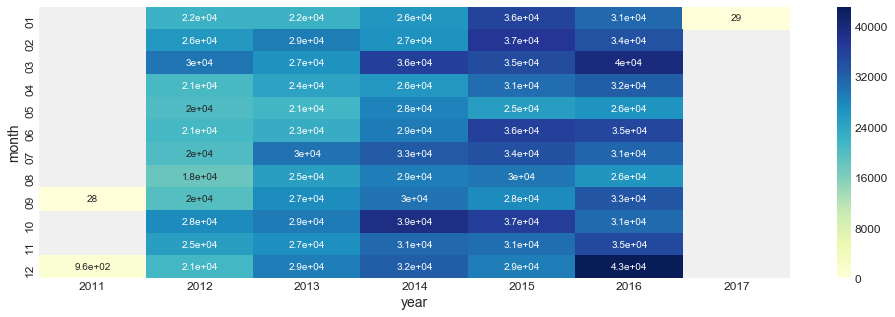

• Drop NaN and incomplete data for 2011 and 2017 to prepare for forecast
```python
Category_001 = Category_001.drop(Category_001.index[[0,1]])
Category_001 = Category_001.drop(Category_001.index[[-1]])
```
Category_001 has 60 months of clean data for predictive analysis
```python
Category_001 = Category_001.set_index('Timestamp')
Category_001.index
DatetimeIndex(['2012-01-31', '2012-02-29', '2012-03-31', '2012-04-30',
               '2012-05-31', '2012-06-30', '2012-07-31', '2012-08-31',
               '2012-09-30', '2012-10-31', '2012-11-30', '2012-12-31',
               '2013-01-31', '2013-02-28', '2013-03-31', '2013-04-30',
               '2013-05-31', '2013-06-30', '2013-07-31', '2013-08-31',
               '2013-09-30', '2013-10-31', '2013-11-30', '2013-12-31',
               '2014-01-31', '2014-02-28', '2014-03-31', '2014-04-30',
               '2014-05-31', '2014-06-30', '2014-07-31', '2014-08-31',
               '2014-09-30', '2014-10-31', '2014-11-30', '2014-12-31',
               '2015-01-31', '2015-02-28', '2015-03-31', '2015-04-30',
               '2015-05-31', '2015-06-30', '2015-07-31', '2015-08-31',
               '2015-09-30', '2015-10-31', '2015-11-30', '2015-12-31',
               '2016-01-31', '2016-02-29', '2016-03-31', '2016-04-30',
               '2016-05-31', '2016-06-30', '2016-07-31', '2016-08-31',
               '2016-09-30', '2016-10-31', '2016-11-30', '2016-12-31'],
              dtype='datetime64[ns]', name='Timestamp', freq=None)
 ```             

• Visualizing observed data

```python
y.plot(figsize=(13,6), title= 'Category_001 Observed Order_Demand', fontsize=14, color="Blue")
plt.show()
```

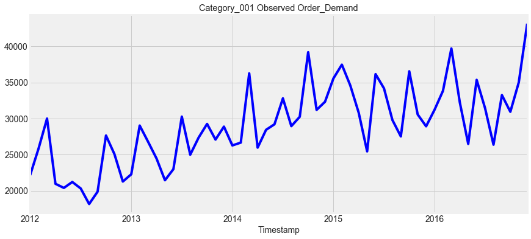

• Split data for each category into train and test sets 80/20% and visualize

```python
train = y.loc['2012-01-31':'2015-12-31']
test = y.loc['2015-12-31':]
train.shape, test.shape
```

```python
train.plot(figsize=(15,6), title= 'Category_001 - Train and Test Data', fontsize=12,color="Green")
test.plot(figsize=(15,6), fontsize=14, color="Red")
plt.show();
```

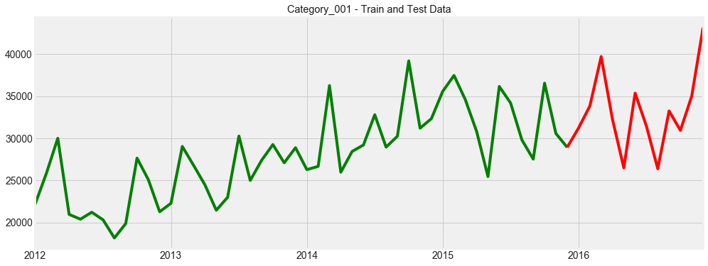

# Building and running forecasting models

• Simple Smoothing

```python
from statsmodels.tsa.api import ExponentialSmoothing, SimpleExpSmoothing, Holt
s_avg = test.copy()
fit_s = SimpleExpSmoothing(train).fit(smoothing_level=0.2,optimized=False)
s_avg['S_Smooth'] = fit_s.forecast(len(test))
plt.figure(figsize=(14,6))
plt.plot(train, label='Train',color="Green")
plt.plot(test, label='Test')
plt.plot(s_avg['S_Smooth'], label='S_Smooth',color="Red")
plt.title("Simple Smoothing")
plt.legend(loc='best')
plt.show()
```
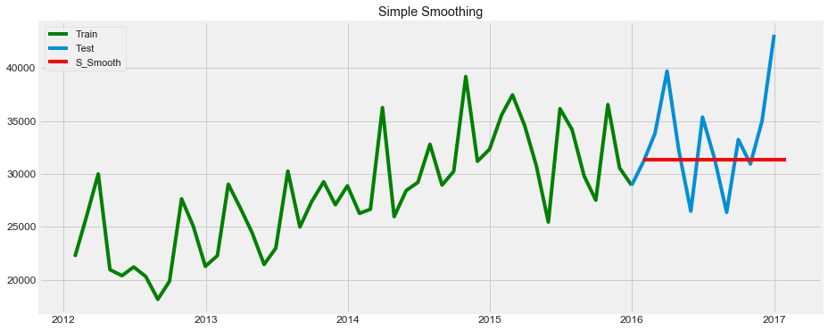

Calculate root mean_squared_error for simple smoothing

```python
import math
from sklearn.metrics import mean_squared_error
SS_RMSE = math.sqrt(mean_squared_error(test, s_avg.S_Smooth))
print('SS_RMSE: %f' % SS_RMSE)
SS_RMSE: 4828.459132
```

• Exponential Smoothing

```python
exp_avg = test.copy()
fit_e = ExponentialSmoothing(train, seasonal_periods=8 ,trend='additive', seasonal='additive',).fit()
exp_avg['E_Smooth'] = fit_e.forecast(len(test))
plt.figure(figsize=(14,6))
plt.plot( train, label='Train',color="Green")
plt.plot(test, label='Test')
plt.plot(exp_avg['E_Smooth'], label='E_Smooth',color="Red")
plt.legend(loc='best')
plt.title("Exponential Smoothing");
plt.show()
```
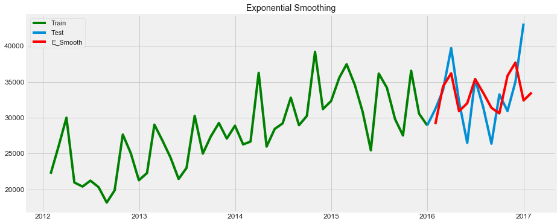 

Calculate root mean_squared_error for exponential smoothing

```python
ES_RMSE = math.sqrt(mean_squared_error(test, exp_avg.E_Smooth))
print('ES_RMSE: %f' % ES_RMSE)
ES_RMSE: 5157.288640
```
• Holt's Linear Trend

Create time-series decomposition plot 

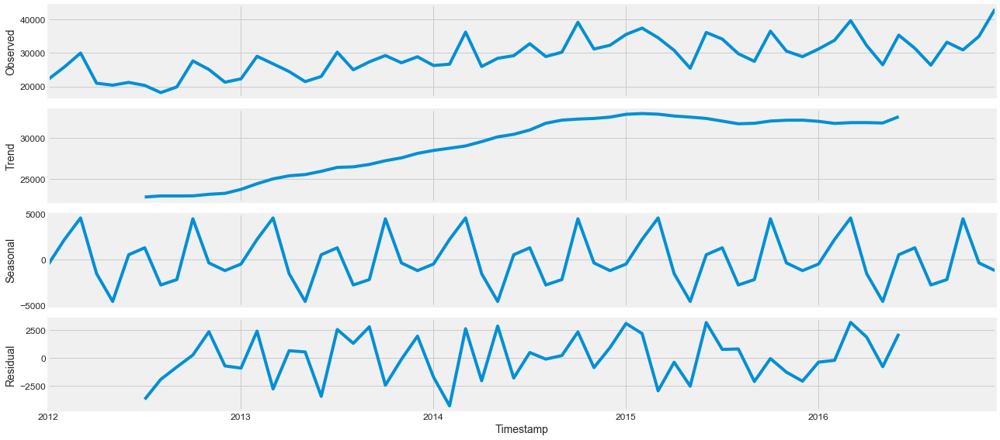 

```python
from pylab import rcParams
rcParams['figure.figsize'] = 18, 8
res = sm.tsa.seasonal_decompose(y.interpolate(), model='additive')
resplot = res.plot()
resplot.savefig('Seasonal_Decompose.png', dpi=150)
```
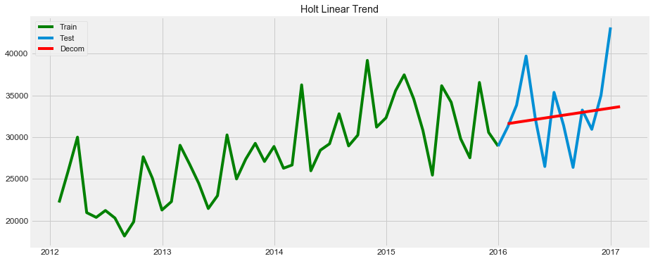 

Calculate root mean_squared_error for Holt's Linear Trend

```python
HL_RMSE = math.sqrt(mean_squared_error(test, decom_avg.Decomp))
print('HL_RMSE: %f' % HL_RMSE)
HL_RMSE: 4431.645674
```
• Holt-Winters Method

```python
hw_avg = test.copy()
fit_hw = ExponentialSmoothing(train , seasonal_periods=4 ,trend='add', seasonal='mul',).fit()
hw_avg['Holt_Winter'] = fit_hw.forecast(len(test))
plt.figure(figsize=(16,8))
plt.plot( train, label='Train', color="Green")
plt.plot(test, label='Test', color="Blue")
plt.plot(hw_avg['Holt_Winter'], label='Holt_Winter', color="Red")
plt.legend(loc='best')
plt.title("Holt-Winters Method");
plt.show()
```
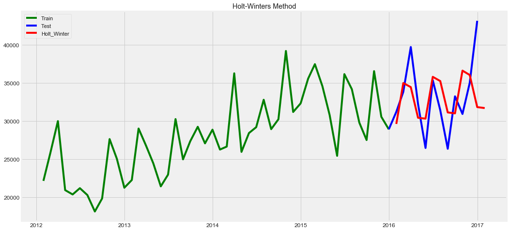 

Calculate root mean_squared_error for Holt-Winters Method

```python
HW_RMSE = math.sqrt(mean_squared_error(test, hw_avg.Holt_Winter))
print('HW_RMSE: %f' % HW_RMSE)
HW_RMSE: 5488.049450
```
• Preliminary seasonal ARIMA

```python
arima_avg = test.copy()
fit_arima = sm.tsa.statespace.SARIMAX(train, order=(2, 1, 4),seasonal_order=(0,1,1,6)).fit()
arima_avg['SARIMA'] = fit_arima.predict(start="2015-12-31", end="2016-12-31", dynamic=True)
plt.figure(figsize=(16,8))
plt.plot( train, label='Train', color="Green")
plt.plot(test, label='Test', color="Blue")
plt.plot(arima_avg['SARIMA'], label='SARIMA', color="Red")
plt.legend(loc='best')
plt.title("Preliminary SARIMA");
plt.show()
```
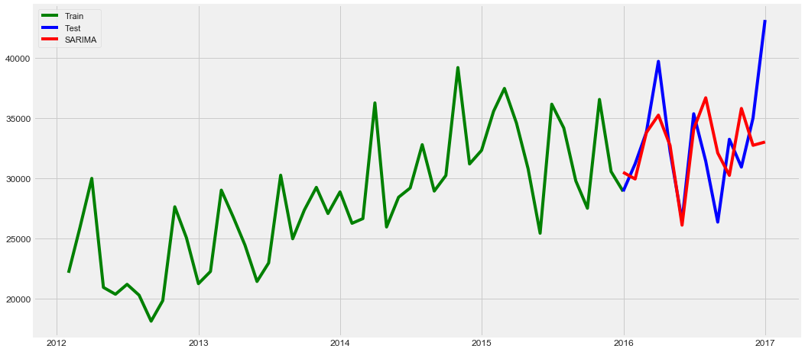 

Calculate root mean_squared_error for seasonal ARIMA

```python
SA_RMSE = math.sqrt(mean_squared_error(test, arima_avg.SARIMA))
print('SA_RMSE: %f' % SA_RMSE)
SA_RMSE: 4176.116086
```

• Adding more features to seasonal ARIMA

Seasonal ARIMA models are denoted with the notation parameters (p, d, q) and accountable for data seasonality, trend, and noise 

```python
p = d = q = range(0, 2)
pdq = list(itertools.product(p, d, q))
seasonal_pdq = [(x[0], x[1], x[2], 12) for x in list(itertools.product(p, d, q))]
print('Examples of parameter combinations for Seasonal ARIMA...')
print('SARIMAX: {} x {}'.format(pdq[1], seasonal_pdq[1]))
print('SARIMAX: {} x {}'.format(pdq[1], seasonal_pdq[2]))
print('SARIMAX: {} x {}'.format(pdq[2], seasonal_pdq[3]))
print('SARIMAX: {} x {}'.format(pdq[2], seasonal_pdq[4]))
Examples of parameter combinations for Seasonal ARIMA...
SARIMAX: (0, 0, 1) x (0, 0, 1, 12)
SARIMAX: (0, 0, 1) x (0, 1, 0, 12)
SARIMAX: (0, 1, 0) x (0, 1, 1, 12)
SARIMAX: (0, 1, 0) x (1, 0, 0, 12)
```

Optimal set of parameters that yields the best performance for the SARIMA

```python
from pmdarima.arima import auto_arima
mod = auto_arima(y, start_p=1, start_q=1,max_p=3, max_q=3, m=25,
                           start_P=0, seasonal=True,
                           d=1, D=1, trace=True,
                           error_action='ignore',  
                           suppress_warnings=True, 
                           stepwise=True,)
print(mod.bic())
Fit ARIMA: order=(1, 1, 1) seasonal_order=(0, 1, 1, 25); AIC=nan, BIC=nan, Fit time=nan seconds
Fit ARIMA: order=(0, 1, 0) seasonal_order=(0, 1, 0, 25); AIC=712.679, BIC=715.731, Fit time=0.031 seconds
Fit ARIMA: order=(1, 1, 0) seasonal_order=(1, 1, 0, 25); AIC=702.119, BIC=708.224, Fit time=0.308 seconds
Fit ARIMA: order=(0, 1, 1) seasonal_order=(0, 1, 1, 25); AIC=nan, BIC=nan, Fit time=nan seconds
Fit ARIMA: order=(1, 1, 0) seasonal_order=(0, 1, 0, 25); AIC=709.355, BIC=713.934, Fit time=0.056 seconds
Fit ARIMA: order=(1, 1, 0) seasonal_order=(2, 1, 0, 25); AIC=nan, BIC=nan, Fit time=nan seconds
Fit ARIMA: order=(1, 1, 0) seasonal_order=(1, 1, 1, 25); AIC=nan, BIC=nan, Fit time=nan seconds
Fit ARIMA: order=(1, 1, 0) seasonal_order=(2, 1, 1, 25); AIC=nan, BIC=nan, Fit time=nan seconds
Fit ARIMA: order=(0, 1, 0) seasonal_order=(1, 1, 0, 25); AIC=700.888, BIC=705.467, Fit time=0.700 seconds
Fit ARIMA: order=(0, 1, 1) seasonal_order=(1, 1, 0, 25); AIC=696.004, BIC=702.109, Fit time=0.258 seconds
Fit ARIMA: order=(1, 1, 2) seasonal_order=(1, 1, 0, 25); AIC=nan, BIC=nan, Fit time=nan seconds
Fit ARIMA: order=(0, 1, 1) seasonal_order=(0, 1, 0, 25); AIC=701.525, BIC=706.104, Fit time=0.192 seconds
Fit ARIMA: order=(0, 1, 1) seasonal_order=(2, 1, 0, 25); AIC=nan, BIC=nan, Fit time=nan seconds
Fit ARIMA: order=(0, 1, 1) seasonal_order=(1, 1, 1, 25); AIC=nan, BIC=nan, Fit time=nan seconds
Fit ARIMA: order=(0, 1, 1) seasonal_order=(2, 1, 1, 25); AIC=nan, BIC=nan, Fit time=nan seconds
Fit ARIMA: order=(1, 1, 1) seasonal_order=(1, 1, 0, 25); AIC=693.981, BIC=701.613, Fit time=1.867 seconds
Fit ARIMA: order=(2, 1, 2) seasonal_order=(1, 1, 0, 25); AIC=697.968, BIC=708.652, Fit time=1.051 seconds
Fit ARIMA: order=(1, 1, 1) seasonal_order=(0, 1, 0, 25); AIC=706.017, BIC=712.123, Fit time=0.182 seconds
Fit ARIMA: order=(1, 1, 1) seasonal_order=(2, 1, 0, 25); AIC=nan, BIC=nan, Fit time=nan seconds
Fit ARIMA: order=(1, 1, 1) seasonal_order=(1, 1, 1, 25); AIC=nan, BIC=nan, Fit time=nan seconds
Fit ARIMA: order=(1, 1, 1) seasonal_order=(2, 1, 1, 25); AIC=nan, BIC=nan, Fit time=nan seconds
Fit ARIMA: order=(2, 1, 1) seasonal_order=(1, 1, 0, 25); AIC=696.302, BIC=705.460, Fit time=0.572 seconds
Total fit time: 5.247 seconds
701.61285453863
```

Fit seasonal ARIMA model

```python
mod = sm.tsa.statespace.SARIMAX(y, trend='n', order=(0, 1, 1),seasonal_order=(0, 1, 0, 25),enforce_invertibility=False)
results = mod.fit()
print (results.summary())
Statespace Model Results                                 
==========================================================================================
Dep. Variable:                       Order_Demand   No. Observations:                   60
Model:             SARIMAX(0, 1, 1)x(0, 1, 0, 25)   Log Likelihood                -349.191
Date:                            Fri, 12 Jul 2019   AIC                            702.382
Time:                                    20:06:37   BIC                            705.435
Sample:                                01-31-2012   HQIC                           703.423
                                     - 12-31-2016                                         
Covariance Type:                              opg                                         
==============================================================================
                 coef    std err          z      P>|z|      [0.025      0.975]
------------------------------------------------------------------------------
ma.L1         -0.6133      0.094     -6.558      0.000      -0.797      -0.430
sigma2      4.274e+07   3.73e-10   1.15e+17      0.000    4.27e+07    4.27e+07
===================================================================================
Ljung-Box (Q):                       49.88   Jarque-Bera (JB):                 0.44
Prob(Q):                              0.03   Prob(JB):                         0.80
Heteroskedasticity (H):               0.89   Skew:                            -0.26
Prob(H) (two-sided):                  0.85   Kurtosis:                         2.82
===================================================================================
```

Plot diagnostics to investigate unusual model behavior

```python
results.plot_diagnostics(figsize=(16, 8))
plt.show()
```

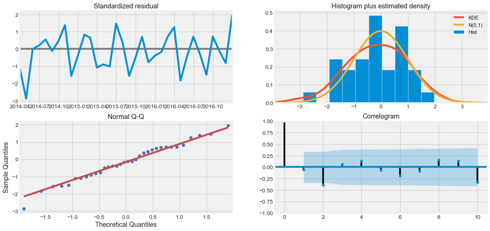

Validate the accuracy of product demand forecast looking at predicted mean for test set of data

```python
pred = results.get_prediction(start=pd.to_datetime('2015-01-31'), dynamic=False)
pred_ci = pred.conf_int()
print(pred_ci)
ax = y['2012':].plot(label='observed')
pred.predicted_mean.plot(ax=ax, label='Test Forecast', alpha=.7, figsize=(14, 7))
ax.fill_between(pred_ci.index,
                pred_ci.iloc[:, 0],
                pred_ci.iloc[:, 1], color='k', alpha=.2)
ax.set_xlabel('Date')
ax.set_ylabel('Category_001 Demand')
plt.legend()
plt.show()
lower Order_Demand  upper Order_Demand
2015-01-31        17279.426025        42907.153136
2015-02-28        20407.144408        46034.865697
2015-03-31        28797.497327        54425.216426
2015-04-30        23826.850336        49454.568612
2015-05-31        19257.135380        44884.853346
2015-06-30        13685.261041        39312.978891
2015-07-31        18958.187982        44585.905789
2015-08-31        27168.616195        52796.333984
2015-09-30        17955.417144        43583.134928
2015-10-31        19080.317293        44708.035074
2015-11-30        22765.941868        48393.659649
2015-12-31        18657.644380        44285.362160
2016-01-31        19467.179348        45094.897128
2016-02-29        16448.505813        42076.223593
2016-03-31        18605.570754        44233.288534
2016-04-30        31411.308366        57039.026145
2016-05-31        16485.178254        42112.896034
2016-06-30        17864.858628        43492.576408
2016-07-31        20445.876245        46073.594025
2016-08-31        23333.392429        48961.110209
2016-09-30        15703.779810        41331.497590
2016-10-31        18829.618258        44457.336038
2016-11-30        27505.777288        53133.495067
2016-12-31        17457.679676        43085.397456
```
Visualizing order demand forecast for last 2 years of our trained data

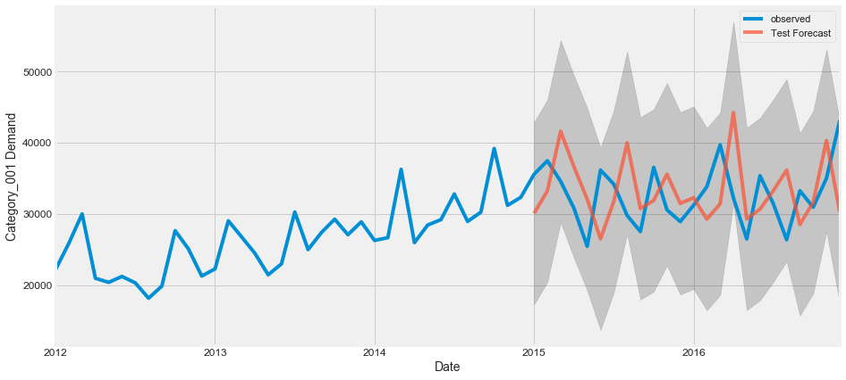

```python
pred_uc = results.get_forecast(steps=14)
pred_ci = pred_uc.conf_int()

ax = y.plot(label='observed', figsize=(14, 7))
pred_uc.predicted_mean.plot(ax=ax, label='Forecast')
ax.fill_between(pred_ci.index,
                pred_ci.iloc[:, 0],
                pred_ci.iloc[:, 1], color='k', alpha=.25)
ax.set_xlabel('Date')
ax.set_ylabel('Category_001 Demand')
plt.legend()
plt.show()
print(pred_ci)
print(pred_uc)
```

Visualizing future demand forecast for year 2017

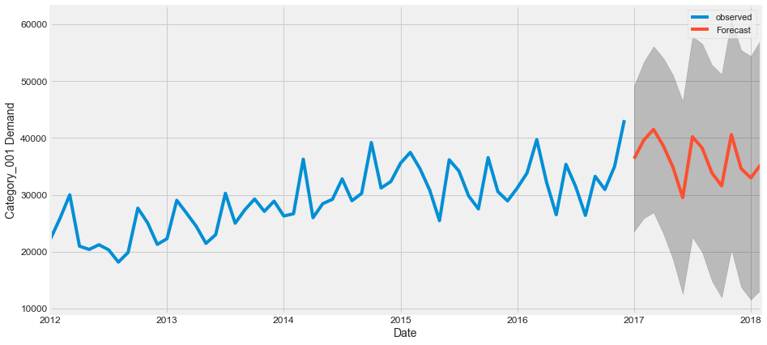

Category_001 predicted demand in January 2017

```python
pred_uc.predicted_mean[0:1]
2017-01-31    36377.920761
Freq: M, dtype: float64
```
• Comparing root mean square error for all the models

 ```python
 # create groups for
n_groups = 5
MSE = (SS_RMSE, ES_RMSE, HL_RMSE, HW_RMSE, SA_RMSE)
 
# create plot
fig, ax = plt.subplots()
index = np.arange(n_groups)
bar_width = 0.35
opacity = 0.8
 
rects2 = plt.bar(index + bar_width, MSE, bar_width, alpha=opacity, color='b', label='Models')
 
plt.ylabel('Root Mean Square Error')
plt.title('Root Mean Square Error')
plt.xticks(index + bar_width, ('Simple_Smoothing', 'Exponential_Smoothing', 'Holt Linear', 'Holt-Winters', 'Seasonal_ARIMA'))
plt.legend()
```

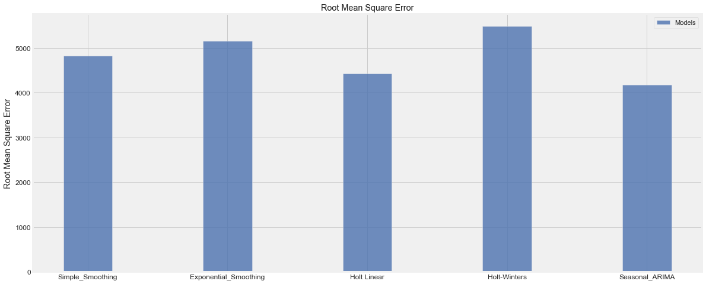


